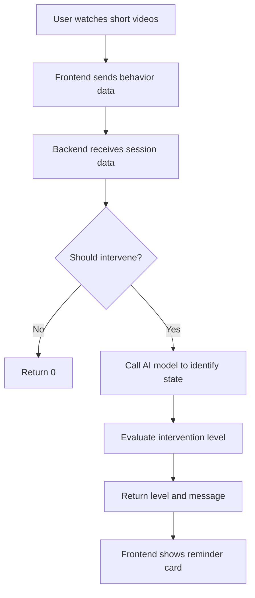
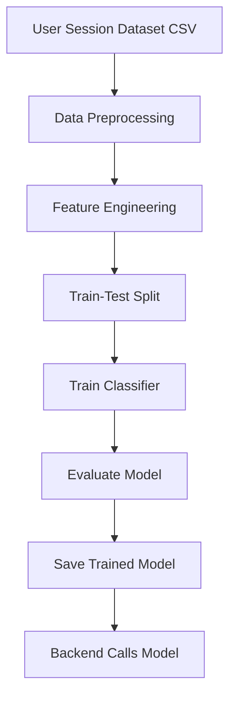

# AI-Powered-Anti-Short-Video-Addiction-Assistant
It's an AI-powered behavioral assistant built to detect and mitigate unconscious short-video addiction. It leverages machine learning and multi-agent systems, developed within the Trae IDE, to classify user behavior, recognize digital overconsumption patterns, and trigger personalized, empathetic interventions.

## 🧠 Real-Time Intervention Flow




## 🤖 AI Training Pipeline



## 🤖 WEB 
```mermaid
graph TD
  A[📱 User watches videos] --> B[🌐 Frontend accumulates 5 video sessions]
  B --> C[📩 Send session data to FastAPI/api/intervene]

  C --> D{🔍 should_intervene}
  D -- No --> E[✅ Return 'normal' status to frontend]
  D -- Yes --> F[🤖 Call behavior classification AI]

  F --> G[📨 Get psychological label e.g., anxious]
  G --> H[🧠 Send label + user goal + session data to GPT Novita]
  H --> I[📝 GPT generates advice + reasoning]
  I --> J[📤 Return advice + reason to frontend]
  J --> K[🖼️ Web displays emotional support/reminder card]

  C --> L[💽 Optional: Save session to SQLite]
