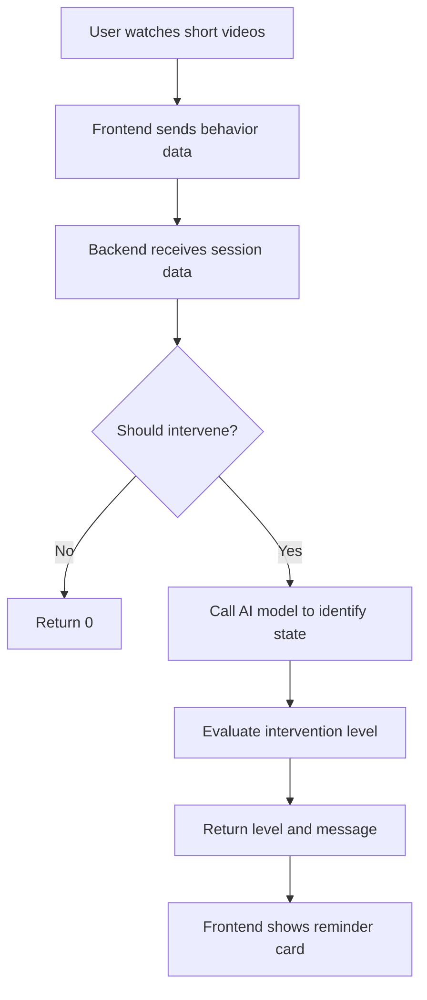

# AI-Powered-Anti-Short-Video-Addiction-Assistant
It's an AI-powered behavioral assistant built to detect and mitigate unconscious short-video addiction. It leverages machine learning and multi-agent systems, developed within the Trae IDE, to classify user behavior, recognize digital overconsumption patterns, and trigger personalized, empathetic interventions.

# Backend 
< FastAPI Python >
### start command:
uvicorn main:app --reload

# Frontend 
< Node.js >
### start command:
node server.js

## 🧠 Real-Time Intervention Flow

