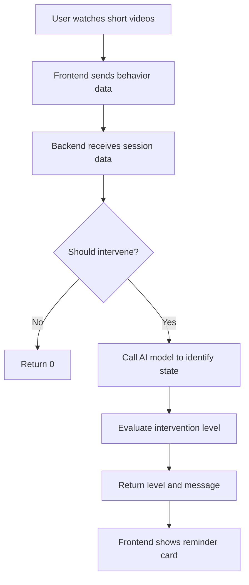
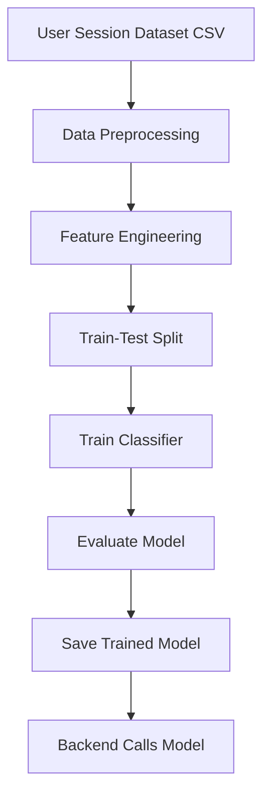

## 🧠 Real-Time Intervention Flow

```mermaid
graph TD
    A[User watches short videos]
    A --> B[Frontend sends behavior data]
    B --> C[Backend receives session data]
    C --> D{Should intervene?}
    D -- No --> X[Return 0]
    D -- Yes --> E[Call AI model to identify state]
    E --> F[Evaluate intervention level]
    F --> G[Return level and message]
    G --> H[Frontend shows reminder card]
```

## 🤖 AI Training Pipeline

```mermaid
flowchart TD
    A[User Session Dataset CSV] --> B[Data Preprocessing]
    B --> C[Feature Engineering]
    C --> D[Train-Test Split]
    D --> E[Train Classifier]
    E --> F[Evaluate Model]
    F --> G[Save Trained Model]
    G --> H[Backend Calls Model]
```
